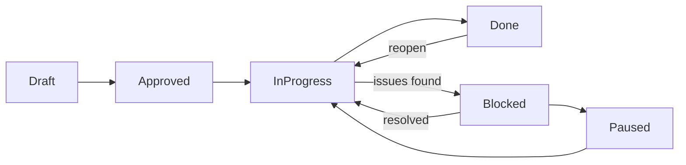
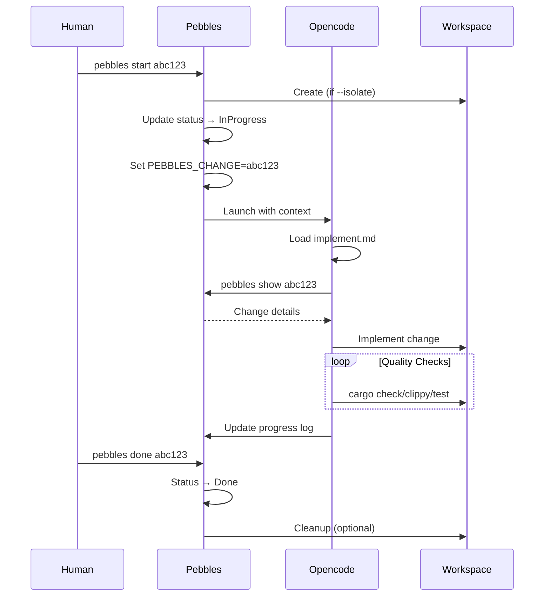

# Pebbles Workflow Guide

This guide explains how to use Pebbles for both human-driven and AI-assisted development workflows.

## Overview

Pebbles manages work items (changes) through their lifecycle while integrating with version control and AI assistants. It supports both manual workflows and agentic automation.

---

## Human Workflow

### 1. Creating Work

**Create a single change:**
```bash
pebbles new "Fix login validation"
```

**Create and immediately edit:**
```bash
pebbles new "Fix login validation" --edit
# Opens editor to add details
```

**Bulk import from text:**
```bash
pebbles intake features.txt
# AI parses the file and creates related changes
```

**Break down complex work:**
```bash
pebbles new "Implement user authentication system"
pebbles plan abc123
# AI creates subtasks with parent-child relationship
```

### 2. Status Lifecycle



| Status         | Meaning                          |
|----------------|----------------------------------|
| **Draft**      | New idea, needs refinement       |
| **Approved**   | Ready to be worked on            |
| **InProgress** | Currently being implemented      |
| **Blocked**    | Has dependencies preventing work |
| **Paused**     | Work temporarily suspended       |
| **Done**       | Complete and verified            |

### 3. Working on Changes

**Move change through workflow:**
```bash
pebbles approve abc123     # Draft → Approved
pebbles start abc123       # Approved → InProgress, launch AI
pebbles done abc123        # Mark complete
```

**Start modes:**
```bash
pebbles start abc123               # Work in current directory
pebbles start abc123 --isolate     # Create isolated workspace
pebbles start abc123 --wait        # Open AI without auto-implement
```

**Manage dependencies:**
```bash
pebbles block abc123 def456    # abc123 blocked by def456
pebbles unblock abc123 def456  # Remove dependency
```

**Update change details:**
```bash
pebbles update abc123 --title "New title"
pebbles update abc123 --priority high
pebbles update abc123 --changelog feature
pebbles edit abc123            # Open in editor
```

### 4. Viewing Changes

```bash
pebbles list                    # All active changes
pebbles list --all             # Include done changes
pebbles list --status inprogress
pebbles list --priority high
pebbles show abc123            # Full details
pebbles log abc123             # Event history
```

### 5. Workspace Context

When inside a workspace:
```bash
pebbles current                # Show current change
pebbles status                 # Workspace + change status
pebbles edit                   # Edit current change
```

### 6. Cleanup

```bash
pebbles cleanup abc123         # Remove workspace
pebbles delete abc123          # Delete change entirely
```

---

## Agentic Workflow

### How AI Integration Works

When you run `pebbles start`, Pebbles:
1. Updates the change status to **InProgress**
2. Sets environment variables:
   - `PEBBLES_CHANGE=<id>` - Current change ID
   - `PEBBLES_VCS=<system>` - Detected VCS
3. Launches opencode with the change context
4. Auto-runs `/implement` (unless `--wait` is used)

### AI Implementation Flow



### AI Command Reference

| Command      | Purpose                         |
|--------------|---------------------------------|
| `/implement` | Guide AI through implementation |
| `/describe`  | Generate commit message         |

These commands are defined in `.opencode/commands/`:
- `implement.md` - Full implementation workflow
- `describe.md` - Commit message generator

### AI Responsibilities

When implementing (`/implement`):
1. **Read context** - Parse change details and acceptance criteria
2. **Plan work** - Create todo list from criteria
3. **Implement** - Write code following project conventions
4. **Verify** - Run all quality checks (compile, lint, test)
5. **Document** - Update change with progress log
6. **Complete** - Set changelog type, mark done

When generating commits (`/describe`):
1. View VCS diff
2. Read change context
3. Generate Google-style commit message
4. Explain WHY, not just WHAT

---

## Common Workflow Examples

### Example 1: Bug Fix

```bash
# Human: Report the bug
pebbles new "Fix null pointer in user service" --edit
# Editor opens - add details, acceptance criteria

# Human: Start the fix
pebbles start abc123

# AI: Reads change, implements fix
# AI: Runs cargo check, cargo test
# AI: Updates change with progress
# AI: pebbles done abc123 --auto

# Human: Review and merge
pebbles cleanup abc123
```

### Example 2: Feature with Subtasks

```bash
# Human: Create parent feature
pebbles new "Add user authentication" --edit
# Editor opens - add high-level description

# Human: AI breaks it down
pebbles plan abc123
# AI creates child changes:
#   - Create login form UI
#   - Implement session management  
#   - Add password hashing
#   - Write integration tests

# Human: Work through children
pebbles start abc123-1  # First subtask
# ... AI implements ...
pebbles done abc123-1

pebbles start abc123-2  # Next subtask
# ... continues ...

# Human: Complete parent when all children done
pebbles show abc123     # Verify all children complete
pebbles done abc123
```

### Example 3: Bulk Intake from Planning

```bash
# Human: Create planning document (features.txt)
cat > features.txt << 'EOF'
# Q2 Feature Plan

## User Dashboard
Build a dashboard showing user statistics
- Display total logins
- Show recent activity
- Export data to CSV

## Performance Improvements
Optimize database queries
- Add indexes to user table
- Cache frequently accessed data
EOF

# Human: Import all at once
pebbles intake features.txt
# AI creates:
#   - Parent: Q2 Feature Plan
#     - Child: Build user dashboard
#       - Subtask: Display total logins
#       - Subtask: Show recent activity  
#       - Subtask: Export data to CSV
#     - Child: Performance improvements
#       - Subtask: Add indexes to user table
#       - Subtask: Cache frequently accessed data

# Human: Now work through systematically
pebbles list
pebbles start abc001
# ... etc ...
```

### Example 4: Dependency Chain

```bash
# Human: Create infrastructure change first
pebbles new "Create database migration framework"
pebbles approve abc100

# Human: Create feature that depends on it
pebbles new "Migrate users table to new schema"
pebbles block abc101 abc100    # abc101 blocked by abc100

# Human: Work on infrastructure
pebbles start abc100
# AI implements...
pebbles done abc100

# Human: Now blocked change is unblocked
pebbles list
# Shows: abc101 ready (dependency resolved)
pebbles start abc101
# AI implements...
```

### Example 5: Pause and Resume

```bash
# Human: Start work
pebbles start abc200
# AI begins implementation

# Human: Emergency bug needs attention
pebbles status
# Shows current context
# Note: AI work is in workspace/branch

# Switch to fix emergency...
pebbles new "Hotfix: Critical security issue"
pebbles start abc201 --isolate
# AI works in isolated workspace
pebbles done abc201

# Human: Resume previous work
pebbles start abc200
# Returns to previous context
# AI continues from where it left off
```

### Example 6: Review and Iterate

```bash
# Human: Review AI's work
pebbles show abc300
# Check acceptance criteria

# Human: Not quite right - add feedback
pebbles update abc300
# Editor opens - add notes to Log section

# Human: Re-start for AI to continue
pebbles start abc300
# AI reads updated log, continues implementation

# Repeat until satisfied...

pebbles done abc300 --force
# Force done even if criteria not perfectly met
```

---

## Best Practices

### For Humans

1. **Write good acceptance criteria** - Be specific and testable
2. **Use `--isolate` for large changes** - Keeps main workspace clean
3. **Keep changes small** - Easier to review, faster to implement
4. **Update the log** - Add notes for future reference
5. **Set changelog types** - Helps with release notes

### For AI Agents

1. **Always read the change first** - Understand requirements before coding
2. **Follow existing patterns** - Check neighboring files for conventions
3. **Run quality checks** - Never skip cargo check/clippy/test
4. **Update progress incrementally** - Keep humans informed
5. **Be specific in logs** - "Fixed NPE in UserService" not "made progress"

### Parent-Child Relationships

Use parent-child relationships to:
- Break down epics into stories
- Track related bug fixes
- Organize multi-step migrations
- Group refactoring work

View tree structure:
```bash
pebbles list
```

### Event Tracking

Every action is logged for audit:
```bash
pebbles log abc123
```

Shows:
- When created
- Status transitions
- Priority changes
- Dependency changes
- Log updates

---

## Quick Reference

| Task            | Command                                    |
|-----------------|--------------------------------------------|
| Create change   | `pebbles new "Title"`                      |
| Bulk import     | `pebbles intake file.txt`                  |
| List changes    | `pebbles list [--all]`                     |
| View details    | `pebbles show <id>`                        |
| Approve         | `pebbles approve <id>`                     |
| Start work      | `pebbles start <id> [--isolate \| --wait]` |
| Current context | `pebbles current`                          |
| Mark done       | `pebbles done <id> [--auto \| --force]`    |
| Add blocker     | `pebbles block <id> <blocks>`              |
| Plan breakdown  | `pebbles plan <id>`                        |
| Update          | `pebbles update <id> --title/...`          |
| Edit            | `pebbles edit <id>`                        |
| View history    | `pebbles log <id>`                         |
| Delete          | `pebbles delete <id>`                      |
| Cleanup         | `pebbles cleanup <id>`                     |
